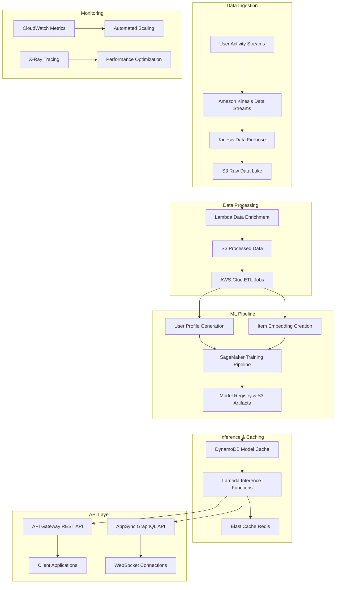

# CodeCatalyst: Unified Cross-Domain Recommendation System

*An intelligent, serverless recommendation system that unifies user experiences across Amazon's ecosystem by breaking down data silos and delivering truly personalized recommendations.*

---

## 🎯 Overview

CodeCatalyst transforms how users discover content across Amazon's ecosystem. Instead of treating Prime Video, Kindle, and Amazon Music as separate silos, our system creates a unified recommendation experience that understands user preferences holistically.

**Key Innovation**: Cross-domain semantic mapping that connects books, movies, and music in a shared embedding space, enabling intelligent recommendations like suggesting the film adaptation after you finish reading a book.

---

## 🚧 Problem Statement

### Current Limitations
- **Fragmented Experiences**: Each Amazon service operates independently, missing cross-platform insights
- **Limited Context Awareness**: Traditional systems ignore temporal, emotional, and social contexts
- **Shallow Personalization**: Recommendations rely heavily on genre similarity without understanding deeper user preferences
- **Underutilized Data**: Rich signals from shopping patterns, reading habits, and social interactions remain unexplored

### Business Impact
- Reduced user engagement across services
- Missed cross-selling opportunities
- Lower customer lifetime value
- Suboptimal content discovery experience

---

## 💡 Solution

CodeCatalyst addresses these challenges through:

### 🎓 Intelligent Cross-Domain Mapping
**Scenario**: Student finishes "The Great Gatsby" on Kindle
**Result**: System recommends → 2013 film adaptation on Prime Video → Jazz soundtrack on Amazon Music → Fitzgerald anthology for purchase

### 🎭 Context-Aware Recommendations
**Scenario**: User listening to melancholic indie music
**Result**: System suggests → Matching mood dramas → Philosophical books → Curated playlists

### 👥 Social-First Design
**Scenario**: Friends plan a virtual watch party
**Result**: System enables → Synchronized viewing → Real-time chat with sentiment analysis → Group-based recommendations

---

## ✨ Features

### 🧠 Advanced ML Pipeline
- **Hybrid Architecture**: Combines collaborative filtering (ALS) with content-based filtering (TF-IDF/SBERT)
- **Cross-Domain Embeddings**: Unified semantic space for books, movies, and music
- **Real-Time Learning**: Adapts to user behavior in real-time using streaming data

### 🌐 Contextual Intelligence
- **Temporal Awareness**: Time-of-day and seasonal preferences
- **Mood Detection**: Emoji interactions and listening patterns inform emotional state
- **Demographic Clustering**: Age and location-based preference modeling

### 👥 Social Integration
- **Watch Parties**: Synchronized viewing with live chat
- **Sentiment Analysis**: Real-time chat sentiment influences group recommendations
- **Social Signals**: Friend activity and shared preferences

### ⚡ Enterprise-Grade Infrastructure
- **100% Serverless**: Built on AWS with auto-scaling capabilities
- **High Performance**: Targeting sub-200ms P99 latency for real-time recommendations
- **Cost Efficient**: Pay-per-use model with intelligent resource management
- **Monitoring & Observability**: Comprehensive logging and metrics via CloudWatch

---

## 🏗️ AWS Serverless Architecture

### Core AWS Services Integration

#### Data Ingestion Layer
**Amazon Kinesis Data Streams**
- Real-time ingestion of user activity across Prime Video, Kindle, Amazon Music
- Handles high-velocity data streams with automatic scaling
- Configured with multiple shards for parallel processing
- Retention period set to 24 hours for replay capabilities

**Amazon Kinesis Data Firehose**
- Automatically delivers streaming data to S3 data lake
- Performs data transformation and compression (Parquet format)
- Configurable buffering (1MB or 60 seconds) for optimal batch sizes
- Error record handling with separate S3 bucket for failed deliveries

#### Data Processing Layer
**AWS Lambda Functions**
- **Data Enrichment**: Triggered by Kinesis events, enriches raw data with user profiles and item metadata
- **Real-time Inference**: Serves recommendation requests with sub-200ms target latency
- **Model Deployment**: Manages model artifact updates and version control
- **Watch Party Engine**: Handles WebSocket connections for synchronized viewing experiences

**Amazon S3 Data Lake**
- **Raw Data Bucket**: Stores unprocessed user activity data partitioned by date/hour
- **Processed Data Bucket**: Contains enriched and transformed data ready for ML training
- **Model Artifacts Bucket**: Stores trained model files, embeddings, and configuration files
- **Static Assets Bucket**: Hosts web application assets with CloudFront distribution

**AWS Glue ETL Jobs**
- Serverless ETL pipeline for large-scale data transformation
- Converts raw activity logs into structured user-item interaction matrices
- Generates aggregated features for demographic and temporal modeling
- Schedules daily batch processing jobs with automatic retry logic

#### Machine Learning Layer
**Amazon SageMaker**
- **Training Jobs**: Distributed training of ALS collaborative filtering models
- **Processing Jobs**: Large-scale feature engineering and cross-domain embedding generation
- **Model Registry**: Versioning and lifecycle management of trained models
- **Endpoints**: Real-time inference endpoints for high-throughput recommendations (targeting 10K+ RPS)

**Amazon SageMaker Pipelines**
- Automated ML workflow orchestration
- Triggers retraining based on data drift detection
- A/B testing framework for model performance comparison
- Automated model deployment with rollback capabilities

#### Storage Layer
**Amazon DynamoDB**
- **User Profiles Table**: Stores user preferences, demographics, and behavioral patterns
- **Item Metadata Table**: Contains movie, book, and music metadata with GSI for fast lookups
- **Model Artifacts Table**: Caches frequently accessed model predictions and embeddings
- **Session Data Table**: Manages watch party sessions and real-time user interactions

**Amazon ElastiCache (Redis)**
- Caches hot user profiles and popular item recommendations
- Stores real-time session data for watch parties
- Implements recommendation result caching with TTL-based invalidation

#### API and Integration Layer
**Amazon API Gateway**
- RESTful API for recommendation requests
- Rate limiting and throttling protection
- Request/response transformation and validation
- Integration with AWS WAF for security

**AWS AppSync (GraphQL)**
- Real-time subscriptions for watch party features
- Unified API for multiple data sources
- Automatic scaling and caching layer

**Amazon EventBridge**
- Event-driven architecture for cross-service communication
- Triggers model retraining based on data quality metrics
- Orchestrates batch processing workflows

#### Monitoring and Observability
**Amazon CloudWatch**
- Custom metrics for recommendation quality and system performance
- Automated alerting for latency spikes and error rates
- Log aggregation from all Lambda functions and services
- Target SLA monitoring: 99.9% uptime, <200ms P99 latency

**AWS X-Ray**
- Distributed tracing across the entire recommendation pipeline
- Performance bottleneck identification
- Error root cause analysis

**Amazon CloudTrail**
- API audit logging for compliance and security
- Data access tracking for user activity

### System Architecture Flow



### Scalability and Performance Targets

**Throughput Targets**
- Handle 100K+ concurrent users across all Amazon services
- Process 1M+ recommendation requests per hour
- Support 10K+ simultaneous watch party sessions

**Performance Targets**
- API response time: <200ms P99 latency
- Model training completion: <60 minutes for full retrain
- Cold start recommendations: <500ms for new users
- Cross-domain recommendation accuracy: >75%

**Cost Optimization**
- Pay-per-use model with no idle infrastructure costs
- Automatic scaling based on demand patterns
- Spot instances for batch processing workloads
- Intelligent caching to reduce compute costs

---

## 🔬 Technical Deep Dive

### Machine Learning Components

#### 1. Collaborative Filtering (Matrix Factorization)
Uses Alternating Least Squares (ALS) for implicit feedback:

```
R_ui ≈ p_u^T × q_i
```

Where:
- `R_ui`: Predicted rating for user u and item i
- `p_u`: User latent factors
- `q_i`: Item latent factors

**Confidence weighting for implicit feedback:**
```
c_ui = 1 + α × r_ui
```

#### 2. Content-Based Filtering
- **TF-IDF Vectorization**: Converts item metadata (genres, descriptions) into numerical features
- **SBERT Embeddings**: Semantic understanding of content descriptions
- **Cross-Domain Mapping**: Shared embedding space for different content types

**Similarity calculation:**
```
similarity(u, i) = cos(profile_u, features_i) = (profile_u · features_i) / (||profile_u|| × ||features_i||)
```

#### 3. Contextual Modeling
**Temporal weighting:**
```
temporal_score = 1 / (1 + |current_year - content_year| / decay_factor)
```

**Demographic clustering:**
- Age-based preferences
- Geographic preferences
- Seasonal patterns

#### 4. Hybrid Scoring
```python
final_score = (
    w_cf × collaborative_score +
    w_cb × content_score +
    w_ctx × context_score +
    w_social × social_score
)
```

### Cross-Domain Semantic Bridge

Our system maps content across domains using:

1. **Shared Entity Recognition**: Identifies common entities (actors, authors, themes)
2. **Semantic Embeddings**: SBERT-based similarity for cross-domain content
3. **Graph-Based Relationships**: Knowledge graph connecting related items across domains

---

## 📊 Target Performance Metrics

### Recommendation Quality Targets
| Metric | Target Value | Description |
|--------|-------------|-------------|
| **Precision@10** | >0.80 | Relevance of top-10 recommendations |
| **Recall@50** | >0.60 | Coverage of relevant items |
| **NDCG@10** | >0.75 | Position-aware recommendation quality |
| **Coverage** | >75% | Percentage of catalog recommended |
| **Novelty** | >0.20 | Discovery of non-obvious items |
| **Serendipity** | >0.40 | Surprising yet relevant recommendations |

### System Performance Targets
| Metric | Target Value | Description |
|--------|-------------|-------------|
| **API Latency (P99)** | <200ms | Real-time recommendation response |
| **Throughput** | >10K RPS | Concurrent recommendation requests |
| **Model Training Time** | <60 min | Full model retraining duration |
| **Cold Start Success** | >90% | New user satisfaction rate |
| **Cross-Domain Accuracy** | >75% | Cross-platform recommendation relevance |

### Business Impact Targets
- **Cross-Domain Engagement**: +30% increase in multi-service usage
- **Session Duration**: +25% average session time
- **Conversion Rate**: +20% from recommendations to purchases
- **User Retention**: +15% monthly active users

---

## 👥 Team

| Name | LinkedIn |
|------|----------|
| **Akhil Varanasi** | [linkedin.com/in/akhilvaranasi ](https://www.linkedin.com/in/akhil-varanasi/)|
| **Anshul Singhal** | [linkedin.com/in/anshulsinghal](https://www.linkedin.com/in/anshul-singhal-67102421a/) |
| **Tanishq Sharma** | [linkedin.com/in/tanishqsharma](https://www.linkedin.com/in/tanishq-sharma-41725a1b2) |
| **Abhidutta Mukund Giri** | [linkedin.com/in/abhidutta](https://www.linkedin.com/in/abhi-m-g-62925a218/) |

---

## 🙏 Acknowledgments

- **Amazon Web Services** for cloud infrastructure and APIs
- **HackOn with Amazon 5.0** for providing the platform and mentorship
- **MovieLens** for comprehensive datasets

  

